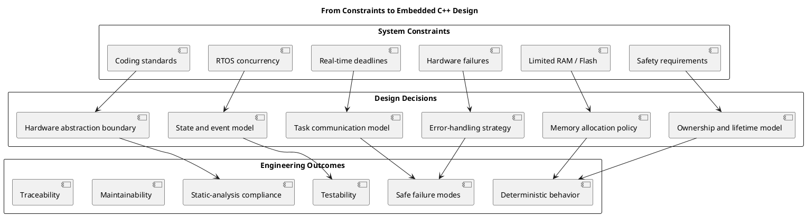

# Modern C++ for Safety-Critical Real-Time Embedded Systems

**Modern C++ for Safety-Critical Real-Time Embedded Systems** is about using modern C++ to build embedded software that is safe, predictable, testable, and efficient under strict resource limits.

This topic is highly relevant to automotive software, including **AUTOSAR-based ECUs, ADAS controllers, body-control modules, battery-management systems, clusters, and infotainment platforms**. It also applies to aerospace, railway, industrial control, robotics, and medical devices.

In normal application development, a memory allocation failure, a delayed task, or an unexpected exception may only cause one process to crash or become slow. In an automotive ECU, the same problem can have more serious effects:

- A control task may miss its real-time deadline.
- An important CAN, LIN, or Ethernet message may be processed too late.
- Memory fragmentation may cause a failure after the vehicle has been running for hours.
- A driver may be initialized in the wrong order and access hardware before clocks or pins are ready.
- A race condition may lead to an incorrect actuator command.
- A fault may not be detected, reported, or moved to a safe state.

Therefore, the main question is not only:

> “Does the code work?”

Our coding mindset must shift entirely from "writing code that runs correctly" to "writing code with absolutely predictable behavior" (Deterministic Behavioral Code).

We must also ask:

- Is runtime memory allocation controlled or forbidden after initialization?
- Is execution time bounded and predictable?
- Can the code run without throwing exceptions in real-time paths?
- Are ownership, object lifetime, and dependencies clear?
- Can the module be tested on a host PC without real hardware?
- Are communication, concurrency, and state changes safe?
- What happens when memory, hardware, communication, or timing fails?

In automotive projects, these concerns are supported by standards and guidelines such as **MISRA C++**, **AUTOSAR C++14**, **CERT C++**, and the safety engineering process around **ISO 26262**. These rules are not simply style rules. They exist to prevent real failure modes that are hard to reproduce and expensive to diagnose in an embedded target.

For example:

- **MEM52-CPP — Detect and handle memory allocation errors**  
  The system must have a clear response when allocation fails. In many ECUs, the preferred solution is not to handle allocation failure during normal driving—it is to avoid it by pre-allocating memory during startup, using fixed-capacity containers, or using bounded memory pools.

- **MEM57-CPP — Avoid using default `operator new` for over-aligned types**  
  Alignment problems may not appear during PC testing but can fail on a target compiler, MCU, or runtime environment. Memory layout and alignment are part of the software design, not only low-level implementation details.

- **OOP51-CPP — Do not slice derived objects**  
  Copying a derived object into a base object by value removes derived data and behavior. This can silently break polymorphic logic. The correct design depends on whether the system needs value semantics, references, runtime polymorphism, or compile-time polymorphism.

