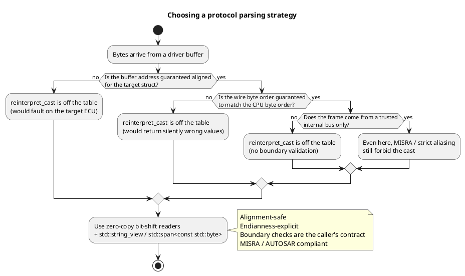
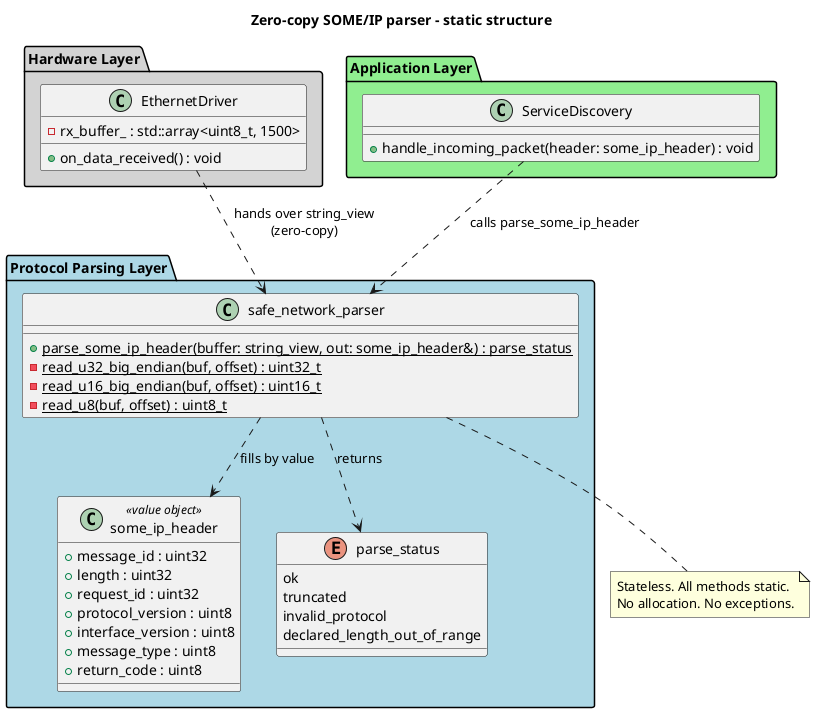
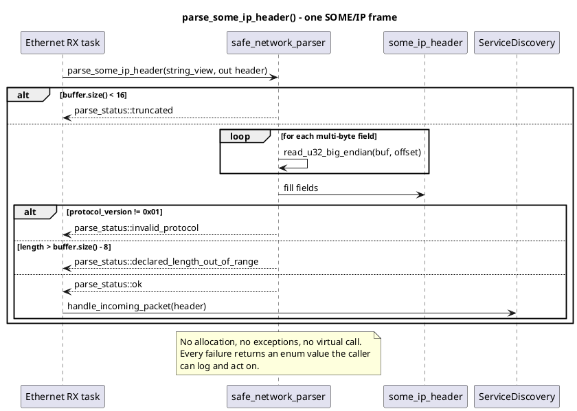

# Data Serialization & Protocol Parsing

## 1. Context and the problem we are solving

An ECU that speaks Automotive Ethernet or CAN-FD lives on a wire. Frames arrive from a MAC or a CAN controller through a DMA ring, and something has to turn those bytes into structured data before the application layer can react — a service-discovery module looking at a SOME/IP header, a wheel-speed decoder pulling four `uint16_t` fields out of a CAN frame, a diagnostic responder chewing on UDS payloads.

The obvious "make it fast" trick is to cast the receive buffer straight to a `struct` and read the fields through the pointer. It compiles, it looks efficient, it shows up in every embedded C tutorial. And it is a landmine.

Every design decision in this folder is a response to three properties of that landmine:

1. **CPU alignment is real.** ARM Cortex-M0/M0+, Cortex-R and Aurix TriCore raise a HardFault when a 32-bit load lands on an unaligned address. DMA controllers do not care about your struct layout.
2. **The wire is Big-Endian; the CPU is (usually) Little-Endian.** Reinterpreting bytes as a struct gives you numerically wrong values, but the code does not crash. It just makes ABS or torque estimation subtly wrong.
3. **The wire is untrusted.** Connected-vehicle interfaces, OBD-II, and V2X links accept frames from the outside world. A length field that says "read a billion bytes" must be caught before it turns into a buffer overrun.

---

## 2. The two designs

| File | What it shows |
|---|---|
| [bad_design.h](bad_design.h) | The "obvious" parser: `reinterpret_cast` from `uint8_t*` to `struct*`. Works on the desk, breaks on the target. |
| [preferred_design.h](preferred_design.h) | Zero-copy, alignment-safe, endianness-explicit parser built with `std::string_view` and bit-shift readers. |
| [main.cpp](main.cpp) | A demo that parses a valid SOME/IP header, then rejects a tampered one. |
| [CMakeLists.txt](CMakeLists.txt) | Build target `safety_data_serialization_and_protocol_parsing`. |

Build and run:

```bash
cd cpp_programming/study
cmake -S . -B build
cmake --build build --target safety_data_serialization_and_protocol_parsing
./build/safety_critical_programming/data_serialization_and_protocol_parsing/safety_data_serialization_and_protocol_parsing
```

---

## 3. Why the "obvious" design is wrong here

`bad_design.h` looks like textbook C. Three things a reviewer with target-hardware experience will call out immediately.

**The cast assumes an alignment nobody promised.** `reinterpret_cast<const wheel_speed_packet*>(raw_buffer)` produces a valid-looking pointer no matter what address `raw_buffer` holds. If the buffer starts at `0x20000001` and the struct's first field is a `uint32_t`, the first load traps. This does not show up on x86 host tests — x86 tolerates unaligned loads silently — so the bug ships to the ECU and detonates during HIL.

**The cast assumes an endianness nobody agreed on.** The bytes on the wire are Big-Endian. The CPU decoding them is Little-Endian. The struct's `uint32_t timestamp` will therefore hold `0x80510100` instead of `0x00015180`. Nothing crashes. The system reports the wrong wheel speed to ABS. This is the class of bug that eats weeks in integration because it looks like a sensor problem, then like a CAN-bus problem, then like a calibration problem, and only much later like a byte-order problem.

**The cast violates strict aliasing.** MISRA C++ Rule 5-2-7 forbids accessing memory through two unrelated pointer types. The C++ standard calls it Undefined Behaviour. Polyspace and QAC will flag it. An aggressive optimizer (LTO, `-O3`) is entitled to break the code in surprising ways because the language guarantees no longer apply.

There is also a fourth, quieter problem: the parser trusts the size argument the caller passed in. On a bus that receives frames from outside the vehicle (V2X, DoIP over Ethernet, OBD-II tester), that is a security bug waiting to be filed as a CVE.

---

## 4. The preferred design

`preferred_design.h` is not exotic. It is the same parser, written the way an embedded engineer would write it after being burned once.

### 4.1 `std::string_view` as a zero-copy handle to the buffer

`std::string_view` is two things: a pointer and a length. No allocation, no copy, no ownership. Passing the driver buffer as a `string_view` gives the parser random access to the bytes with a bounds-checkable size, and it costs exactly as much as passing a `(pointer, length)` pair by hand — because that is what it is.

On C++20 projects the same design is even cleaner with `std::span<const std::byte>`. Two reasons prefer `span<const std::byte>` where the standard allows it:

- `std::byte` is the language's "this is raw memory, not text" type. Static analyzers no longer complain about `reinterpret_cast<const char*>(...)` at the boundary.
- `std::span` was designed for arbitrary contiguous ranges, not for character sequences, so its interface (`.first(n)`, `.subspan(...)`) fits protocol slicing much better than the `string_view` methods that carry historical string semantics.

### 4.2 Byte-by-byte readers instead of `memcpy` + cast

`read_u32_big_endian` reads four independent bytes and reassembles a `uint32_t` with bit shifts. Two properties fall out of that choice for free:

- **Alignment stops being a concern.** A byte load is legal at any address on every CPU. The reassembled value lives in a CPU register, which is trivially aligned.
- **Endianness stops being implicit.** The order of the shifts *is* the specification. When the SOME/IP standard says byte 0 is the most significant, the code says byte 0 is shifted left by 24. The same source file runs identically on Little-Endian ARM and Big-Endian PowerPC because it never asks the CPU which end is which.

This is why the readers are separate helpers and not inline shifts inside `parse_some_ip_header`. They are the smallest unit the codebase needs to unit-test, and they are the natural swap point when a profiler proves that bit-shifting is a bottleneck (see Section 5).

### 4.3 An error enum instead of exceptions

`parse_status` is an `enum class` with four values: `ok`, `truncated`, `invalid_protocol`, `declared_length_out_of_range`. Two reasons to prefer this over throwing:

- AUTOSAR C++14 discourages exceptions on the safety path (rule A15-0-1 and neighbours). Many embedded builds compile with `-fno-exceptions`, in which case a `throw` becomes UB.
- The caller almost always wants to distinguish "packet was corrupt, drop it and increment a diagnostic counter" from "packet was too short, we should wait for more bytes to arrive". A single exception type cannot carry that distinction cleanly; an enum can.

### 4.4 Boundary checks as the first line of every parse function

The `if (buffer.size() < some_ip_header_size)` check is not defensive style — it is the parser's job. Both checks in `parse_some_ip_header` (the size check and the `length` sanity check) exist specifically to prevent a malformed frame from turning into an out-of-bounds read. In a threat model where the sender can be an attacker (V2X, OBD-II, DoIP over Ethernet), these checks are the difference between a dropped frame and a compromised ECU.

---

## 5. Where each design belongs

| Concern | `reinterpret_cast` (bad) | Bit-shift + `string_view` (preferred) |
|---|---|---|
| Alignment safety | Depends on the caller's address | Safe at any address, on any CPU |
| Endianness | Whatever the CPU happens to be | Fixed by the source code |
| MISRA / AUTOSAR compliance | Violates strict aliasing | Compliant |
| Behaviour under `-O3` / LTO | Optimizer may break the code | Well-defined |
| Boundary checks | Only if the caller remembers | Built into every parse function |
| Speed | One pointer assignment | A handful of shifts and ORs per field |
| Best fit | Nothing on a real target | CAN-FD RX, SOME/IP RX, DoIP, UDS, V2X |

The right way to read the "speed" row is: bit-shift is fast enough for headers and short payloads (the common case), and when it is not, you replace the body of one helper function with `__builtin_bswap32` after `memcpy`, not the design.

---

## 6. Details that only show up after a few debug sessions

**Compiler intrinsics do not fix alignment.** `__builtin_bswap32` and `_byteswap_ulong` swap bytes of a value that is already in a register. If you load that value from an unaligned pointer with a plain dereference before calling the intrinsic, the load still faults on strict-alignment cores. The alignment-safe pattern is `memcpy` (or the byte-by-byte reader in this folder) *into* a `uint32_t`, then `bswap` — not `bswap(*reinterpret_cast<uint32_t*>(...))`.

**`std::string_view` was designed for text.** It works for binary because "text" in C++ has always meant "a contiguous sequence of narrow chars". Static analyzers know about the historical string semantics and occasionally complain about the `reinterpret_cast<const char*>(uint8_t_ptr)` at the boundary. On C++20 projects, prefer `std::span<const std::byte>` and stop apologising to the linter.

**Trust the wire's `length` field exactly once — to reject it.** Every packet header carries a length. Every attacker knows that. The single most productive defensive check in a protocol parser is comparing the declared length against the actual buffer size before using it for anything else. The check is one line and it closes a whole class of buffer-overrun CVEs.

**Split the byte readers into their own functions on purpose.** It is tempting to inline the shifts to save a function call. Do not. The helpers are the natural place to (a) unit-test the full corner-case matrix, (b) swap in an intrinsic-based implementation later, and (c) reuse across DoIP, UDS, and CAN-FD parsers. A modern compiler will inline them anyway at `-O2`.

**"Correct first, fast later" is not a slogan here.** The bit-shift readers are already fast enough for CAN-FD frames (at most 64 bytes) and SOME/IP headers (16 bytes). Reach for `__builtin_bswap` only after a profiler on the target ECU tells you the parser is the bottleneck. In most projects it never will be, and the intrinsic-based version just adds `#ifdef` noise to a file that used to be portable.

---

## 7. Architecture diagrams

### 7.1 How to decide which parsing strategy to use



### 7.2 Static structure of the preferred design



### 7.3 What happens on a single `parse_some_ip_header` call


