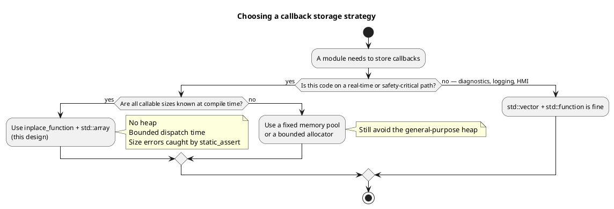
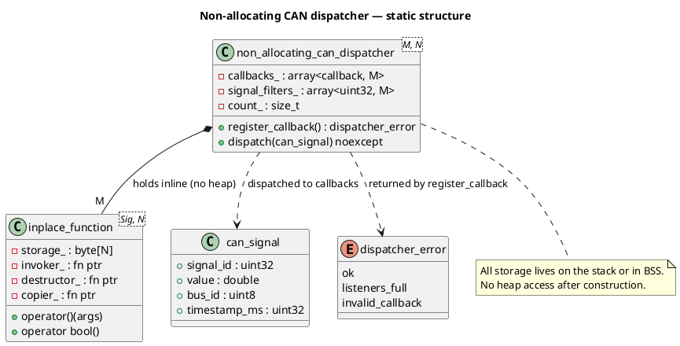
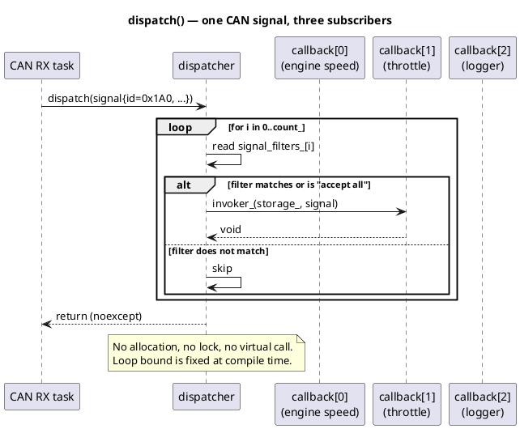

# Event-Driven Callback Dispatch — Design Note

*A short architecture note for a CAN signal dispatcher inside an automotive ECU, with a walk-through of the reference implementation in this folder.*

---

## 1. Context and the problem we are solving

Inside an ECU (Engine Control, ADAS, Gateway, …), CAN messages arrive continuously — often hundreds to thousands per second. Many software components want to react to those messages: a throttle controller reacts to pedal position, a diagnostic module logs faults, a gateway forwards signals to another bus.

We need a small building block — call it a **dispatcher** — that lets components "subscribe" to signals and get called back when a signal arrives. Sounds like a textbook Observer pattern. It is, but with two extra rules that change the design completely:

1. **Deterministic timing.** The time spent inside `dispatch()` must be predictable. If dispatching a signal sometimes takes 5 µs and sometimes 800 µs because the memory allocator decided to defragment, a control loop can miss its deadline.
2. **No hidden heap allocation on the hot path.** Long-running ECUs must avoid heap fragmentation. After start-up we prefer to touch the general-purpose heap **zero times**.

Every design decision below is a direct consequence of those two rules.

---

## 2. The two designs in this folder

| File | What it shows |
|---|---|
| `bad_design.h` | The "obvious" observer written with `std::vector` + `std::function`. Works fine on a PC, quietly unsafe in an ECU. |
| `preferred_design.h` | A fixed-size, heap-free dispatcher built on a custom `inplace_function`. |
| `main.cpp` | A small demo that registers three different kinds of callbacks and dispatches a few CAN frames. |
| `CMakeLists.txt` | Build target `safety_event_and_dynamic_allocation`. |

Build and run:

```bash
cd cpp_programming/study
cmake -S . -B build
cmake --build build --target safety_event_and_dynamic_allocation
./build/safety_critical_programming/event_and_dynamic_allocation/safety_event_and_dynamic_allocation
```

---

## 3. Why the "obvious" design is wrong here

`bad_design.h` looks like code you would happily ship in a desktop application. Let me walk you through what a reviewer with embedded experience notices immediately.

**The listener list uses raw pointers.** `std::vector<can_signal_listener*>` never says who owns those objects. If a listener is destroyed before the dispatcher, the pointer becomes dangling and the next `dispatch()` call is undefined behaviour. The `if (listener)` null-check inside `dispatch()` is not a fix — it is a symptom.

**`std::vector::push_back` can reallocate.** When capacity runs out the vector allocates a new, larger buffer and copies everything over. That is fine on a PC. Inside a 1 kHz control loop, that single reallocation is a latency spike you cannot predict or bound.

**`std::function` may allocate on the heap — and you cannot tell when.** Every standard-library implementation of `std::function` has a small internal buffer (typically 16–32 bytes). If a lambda captures a small integer, everything fits and no allocation happens. If the same lambda later captures one more variable and crosses the buffer size, the constructor silently falls back to `new`. There is no compile error, no warning, no runtime hint. The `heavy_context` example in the file demonstrates exactly this: a ~68-byte capture forces a heap allocation every single time.

**Exceptions.** `std::function`'s constructor can throw `std::bad_alloc`. Many embedded projects build with `-fno-exceptions`, in which case that path becomes undefined behaviour rather than a catchable failure.

> This is why AUTOSAR C++ guidelines (see A18-9-1 and related rules) restrict or forbid `std::function` on safety-critical paths. It is not that `std::function` is bad — it is that its behaviour is not knowable at compile time, and "not knowable" is unacceptable in a safety context.

---

## 4. The preferred design, piece by piece

`preferred_design.h` is not exotic — it is just the observer pattern with the two rules from Section 1 taken seriously. Four types, each with a clear job.

### 4.1 `inplace_function<Signature, StorageSize>` — the callable holder

The whole design rests on one idea: instead of putting the callable on the heap (as `std::function` may do), we reserve a fixed-size byte buffer *inside the object itself* and construct the callable there with placement new.

```cpp
alignas(std::max_align_t) std::byte storage_[StorageSize];
```

Three function pointers replace the vtable that a virtual-based observer would use:

- `invoker_` — knows how to call `operator()` on whatever type lives in the buffer.
- `destructor_` — knows how to call `~F()` when we clean up. Without this, a lambda capturing a `std::shared_ptr` or a scoped lock would leak the resource silently.
- `copier_` — enables copy and move by copying the raw bytes and then reconstructing the object.

The critical safety net is a single line:

```cpp
static_assert(sizeof(decayed_f) <= StorageSize, "Callable too large ...");
```

If someone tries to store a lambda that does not fit, the build fails with a readable message. There is no runtime fallback, no silent heap allocation, no hidden cost. Compare that with `std::function`, where the same mistake compiles and works — until it slows down your ISR at 3 a.m. in a customer's car.

**A small honest trade-off.** `std::function` can *move* in O(1) by stealing an internal pointer. `inplace_function` cannot — it has to copy the raw bytes from one buffer to another and let the source's destructor clean up. For very hot paths this matters; pass by reference where you can.

### 4.2 `can_signal` — the event payload

A `(int, double)` pair is enough for a slide deck. Real ECUs also need to know *which bus* the signal came from and *when* the hardware timestamped it, because deadline monitoring depends on both. `can_signal` carries all four fields together as a plain aggregate — no constructors, no allocations, trivially copyable.

### 4.3 `dispatcher_error` — the failure channel

We do not throw exceptions across component boundaries in this code. AUTOSAR discourages it, and many builds compile with `-fno-exceptions` anyway. A small `enum class` return code (`ok`, `listeners_full`, `invalid_callback`) is enough. The caller decides whether a full listener table is a startup misconfiguration (log and continue) or a fatal integration bug (enter safe state).

### 4.4 `non_allocating_can_dispatcher<MaxListeners, CallbackStorageSize>` — the dispatcher itself

Two template parameters make the resource budget explicit at compile time:

- `MaxListeners` — how many subscribers this dispatcher can ever hold.
- `CallbackStorageSize` — how big each callable is allowed to be.

Both numbers are visible to a reviewer, to a static analyser, and to the linker. There is no dynamic growth, ever.

Internally the dispatcher keeps two `std::array`s of the same length: one for the callbacks, one for per-slot signal-id filters. Contiguous arrays are cache-friendly — the CPU prefetcher walks straight through them without pointer chasing, which matters when `dispatch()` runs a thousand times a second.

`dispatch()` itself is marked `noexcept` and does only three things: read a filter, compare it to the incoming signal id, and either skip or invoke the callback. No allocation, no locking, no virtual call.

**About thread safety.** The dispatcher is deliberately *not* thread-safe. In a real ECU each CAN channel typically has its own task, and mixing dispatch from multiple tasks is a design decision the caller should make explicitly. Baking a mutex into the dispatcher would hide that decision and add cost for the common case where no locking is needed.

---

## 5. Where each design belongs

| Concern | `std::vector` + `std::function` | `std::array` + `inplace_function` |
|---|---|---|
| Heap allocation | Possible, invisible at compile time | None after construction |
| Dispatch timing | Depends on allocator state | Bounded, predictable |
| Callable size check | Runtime, silent | Compile time, loud (`static_assert`) |
| Exception behaviour | May throw `std::bad_alloc` | Fully `noexcept` |
| Maximum listeners | Grows dynamically | Fixed at compile time |
| Memory layout | Pointer chasing | Contiguous, cache-friendly |
| Code simplicity | Very simple | Needs type-erasure knowledge |
| Best fit | Desktop tools, diagnostics, HMI, logging | ISR, CAN RX task, control loops, safety monitors |

Neither design is universally "better". The point is to know which one is in front of you. It is completely fine to use `std::function` in the logging module of the same ECU that uses `inplace_function` in its control loop — as long as the boundary is intentional.

---

## 6. Details that only show up after a few debug sessions

A few things worth pointing out to anyone reading this code for the first time.

**`alignas(std::max_align_t)` is not decoration.** Placement-new on a type whose required alignment is stricter than the buffer's alignment is undefined behaviour. It often "works" on x86-64 during host testing and then faults on an ARM target. The `alignas` line is what makes the buffer safe for any fundamental type, including `double` and SIMD vectors.

**The destructor pointer really is required.** It is tempting to skip it because "the buffer is just bytes". But if the stored callable is a lambda capturing a `std::shared_ptr`, a `std::unique_lock`, or any RAII handle, skipping the destructor call leaks that resource. In practice the leak shows up much later as a deadlock or a slow memory creep — the kind of bug that is expensive to track down.

**`static_assert` is a first-class defence, not a comment.** Whenever a size, an alignment, or a capacity limit exists, put it in a `static_assert` next to the code that depends on it. That turns a whole class of runtime failures into build failures, which is exactly the trade you want to make in a safety context.

**Move is not free here.** In performance-sensitive registration code, prefer to pass the callable by rvalue reference into `register_callback` and let the internal `std::move` do one copy, rather than moving the same `inplace_function` through several intermediate variables. Each move copies the whole storage buffer.

---

## 7. Architecture diagrams

### 7.1 How to decide which callback storage to use



### 7.2 Static structure of the preferred design



### 7.3 What happens on a single dispatch call


